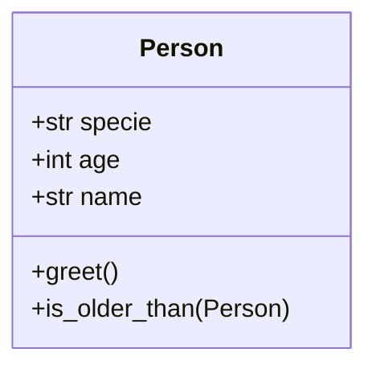

# Ejercicio-1-de-la-clase-6-Clases-y-Objetos

Hecho en mermaid:

```mermaid
classDiagram
    class Person {
        +str specie
        +int age
        +str name
        +greet()
        +is_older_than(Person)
    }
```
## Hecho en python

- [Clase_rectangle](Class_person.py)

Volver al README principal: [README_principal](../README.md)