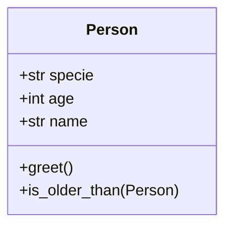

# Ejercicio-1-de-la-clase-6-Clases-y-Objetos
Hecho en mermaid:

El codigo de python quedo lo siguiente:
```python
class Person:
   # Class attribute
   specie: str = "Human"

   def __init__(self, age: int, name: str):
      # Instance attributes
      self.age = age
      self.name = name
   def greet(self):
      print(f"{self.name}, is gretting you!")
   def is_older_than(self, other_person: "Person"):
      # Comparate the age of the a person with another person
      return self.age > other_person.age
```
Volver al README principal: [README_principal](../README.md)