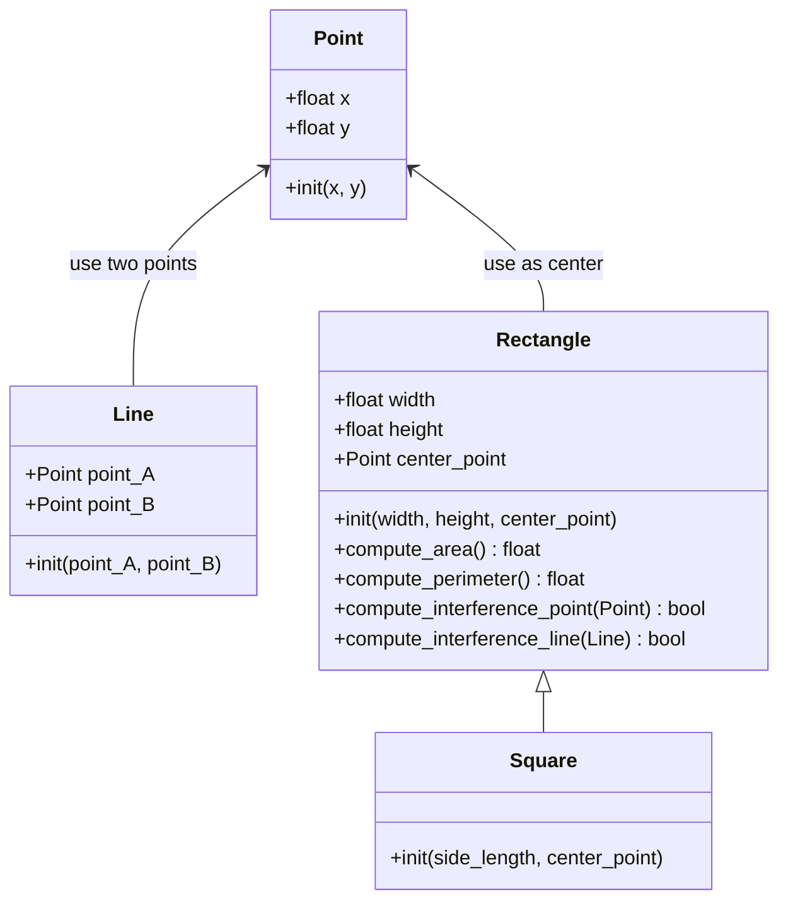

# Clase 7: Herencia en Python

Hecho en mermaid

```mermaid
classDiagram

    class Point {
        +float x
        +float y
        +init(x, y)
    }

    class Line {
        +Point point_A
        +Point point_B
        +init(point_A, point_B)
    }

    class Rectangle {
        +float width
        +float height
        +Point center_point
        +init(width, height, center_point)
        +compute_area() float
        +compute_perimeter() float
        +compute_interference_point(Point) bool
        +compute_interference_line(Line) bool
    }

    class Square {
        +init(side_length, center_point)
    }

    Rectangle <|-- Square
    
    Point <-- Rectangle : use as center
    Point <-- Line : use two points
```

## Hecho en python

- [Clase_rectangle](Class_rectangle.py)

Volver al README principal: [README_principal](../README.md)
