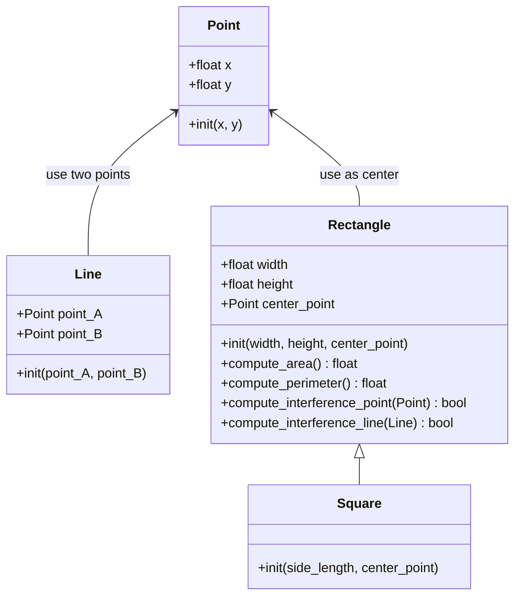

# Clase 7: Herencia en Python

Hecho en mermaid



Hecho en python

```python
class Point:
    def __init__(self, x: float, y: float):
        self.x = x
        self.y = y

class Line:
    def __init__(self, point_A, point_B):
        self.point_A = point_A
        self.point_B = point_B

class Rectangle:
    def __init__(self, width: float, height: float, center_point):
        self.width = width
        self.height = height
        self.center_point = center_point

    def compute_area(self):
        return self.width * self.height

    def compute_perimeter(self):
        return 2*(self.width) + 2*(self.height)

    def compute_interference_point(self, point):
        """ This fuction determinate if a point is inside the rectangle or not. 
        For this, the maximum and minimum values of x and y 
        that a point can have to be inside the rectangle are calculated.
        """
        Min_x = self.center_point.x - (self.width/2)
        Max_x = self.center_point.x + (self.width/2)
        Min_y = self.center_point.y - (self.height/2)
        Max_y = self.center_point.y + (self.height/2)

        """ If the given point has coordinates x and y that are within 
        the calculated maximum and minimum values, then the point is inside
        the rectangle and the function returns True. 
        Otherwise, it returns False.
        """
        if ( Max_x >= point.x >= Min_x and Max_y >= point.y >= Min_y):
            return True
        else:
            return False

    def compute_interference_line(self, line: Line):
        """Use the compute_interference_point function to determine
        if at least one point is inside the rectangle.
        If so, the line segment interferes with the rectangle, 
        and the function returns True. Otherwise, it returns False."""
        is_a_point_inside = self.compute_interference_point(line.point_A)
        is_b_point_inside = self.compute_interference_point(line.point_B)
        if is_a_point_inside or is_b_point_inside:
            return True
        else:
            return False


class Square(Rectangle):
    """ In this class, inheritance is used from the Rectangle class in the initialization,
    area and perimeter calculation functions. Additionally, in the case of width and height,
    the same value is assigned to both in side_length, since a square has equal sides.
    """
    def __init__(self, side_length: float, center_point):
        super().__init__(center_point = center_point, height = side_length, width = side_length)

```

Volver al README principal: [README_principal](../README.md)